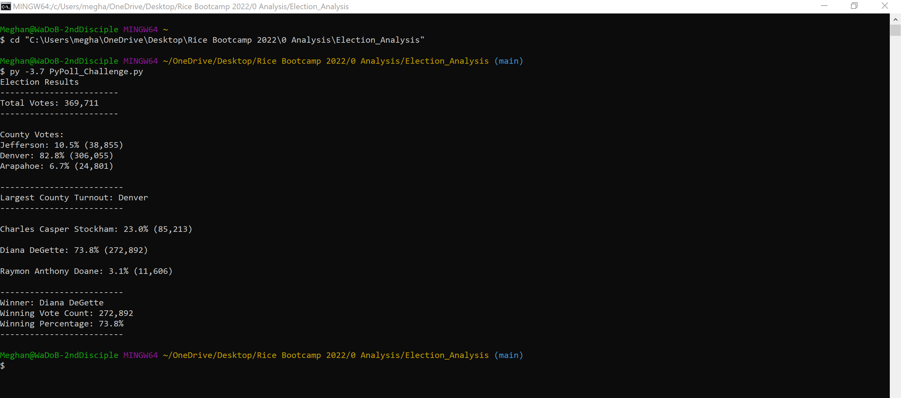

# Election Analysis
## Table of Contents
<details>
<summary>Click to expand</summary>

- [Overview of Election Audit](#overview-of-election-audit)
  - [Project Overview](#project-overview)
  - [Purpose](#purpose)
  - [Resources](#resources)
- [Election Audit Results](#election-audit-results)
  - [Audit Test Case Analysis](#audit-test-case-analysis)
  - [Summary of Python *PyPoll_Challenge.py* Script](#summary-of-python-pypoll_challengepy-script)
- [Election Audit Summary](#election-audit-summary)

</details>

## Overview of Election Audit
### Project Overview
A Colorado Board of Elections employee requested a Python script to automate some election auditing data analysis.  Using a recent local congressional election as a test case, the script is to provide a summary of:
- The total number of votes cast;
- A complete list of candidates who received votes;
- The percentage of votes each candidate won;
- The total number of votes each candidate won;
- The winner of the election based on popular vote.

In subsequent review, the election commission has requested the following additional data:
- The voter turnout for each county;
- The percentage of votes from each county out of the total count;
- The county with the highest turnout.

### Purpose
The purpose of this analysis is to summarize the recent Colorado congressional election results for the election commission's audit, with the goal of extending the analysis methodology to any election.

### Resources
- Data Source: [election_results.csv](Resources/election_results.csv) 
- Software: Python 3.7
- Analysis Code: [PyPoll_Challenge.py](PyPoll_Challenge.py)

## Election Audit Results
### Audit Test Case Analysis
The analysis of the election show that:
- There were 369,711 votes cast in the election.
- The breakdown of votes for each county in the precinct was:

  | County | % of Total Vote | Votes in County |
  | :---         |     :---:      |     :---:      |
  | Jefferson | 10.5% | 38,855 |
  | Denver | 82.8% | 306,055 |
  | Arapahoe | 6.7% | 24,801 |
  
- The county with the largest voter turnout was Denver.
- The candidate results were:
  - Charles Casper Stockham received 23.0% of the vote and 85,213 number of votes.
  - Diana DeGette received 73.8% of the vote and 272,892 number of votes.
  - Raymon Anthony Doane received 3.1% of the vote and 11,606 number of votes.
- The winner of the election was:
  - Diana DeGette, who received 3.1% of the vote and 11,606 number of votes.

### Summary of Python *PyPoll_Challenge.py* Script
The original *[PyPoll.py](PyPoll.py)* code followed the logic:
  1. Initialize variables, with the input file (*file_to_load*) and output file (*file_to_save*) variables hardcoded. 
  2. Gather total votes, the list of candidates, and a dictionary of votes per candidate from input file
  3. Analyze the input data for each candiate (i.e. loop through each candidate and...) 
     - Calculate percentage of total votes and add it to *candidate_results*
     - If the candidate votes are greater than the winning count, update the winning candidate variables
  4. Write results to the output file  

The updated *[PyPoll_Challenge.py](PyPoll_Challenge.py)* code modifies this logic:
  1. Initialize variables, with the input file (*file_to_load*) and output file (*file_to_save*) variables hardcoded. 
      <details><summary>Expand Code Block</summary>
      
      ```
      # Initialize data variables
      total_votes = 0                 # Data 1 - total vote counter
      candidate_options = []          # Data 2 - list of candidates
      candidate_votes = {}            # Data 4 - dictionary of candidate votes
      candidate_results =""           # Empty string for printing Data 2, 3, & 4

      # Initialize Challenge data variables
      # C.S1
      counties = []                   # Empty list of counties
      county_votes = {}               # Empty dictionary of county votes
      county_results =""              # Empty string for printing county results
      # C.S2
      highest_turnout_county = ""     # Name of county with highest turnout
      highest_turnout_count = 0       # Number of votes for county with highest turnout
      highest_turnout_percentage = 0  # Percentage of total vote for county with highest turnout

      # Initialize Data 5 variables - Winning Candidate and Winning Count Tracker
      winning_candidate = ""          # Name of winning candidate
      winning_count = 0               # Number of votes for winning candidate
      winning_percentage = 0          # Percentage of total vote for winning candidate

      # Specify input & output file names
      # Assign a variable for the files and the path (indirect path with os module)
      file_to_load = os.path.join("Resources", "election_results.csv")
      file_to_save = os.path.join("analysis", "election_analysis.txt")
      ```
      </details>
  2. Gather total votes, the list of candidates, a dictionary of votes per candidate, a list of counties, and a dictionary of turnout for each county from input file
      <details><summary>Expand Code Block</summary>
      
      ```
        # Open the election results and read the file with open()
        with open(file_to_load) as election_data:
             # To do: perform analysis.
             # Read the file object with the reader function.
             file_reader = csv.reader(election_data)

             # Get headers
             headers = next(file_reader)

             # Print each row in the CSV file.
             for row in file_reader:
                #----------------------------------------------------------------
                # Data 1 - Add to the total vote count
                #----------------------------------------------------------------
                total_votes += 1

                #----------------------------------------------------------------
                # Data 2 - Add new candidate names
                #----------------------------------------------------------------
                # Find the candidate name from each row
                candidate_name = row[2]

                # Check if the candidate does not match any existing candidate
                if candidate_name not in candidate_options:
                     # D2 - Add the candidate name to the candidate list.
                     candidate_options.append(candidate_name)

                     # D3 - Begin tracking that candidate's vote count.
                     candidate_votes[candidate_name] = 0

                #----------------------------------------------------------------
                # Data 4 - Add to candidate vote count
                #----------------------------------------------------------------
                # Add a vote to that candidate's count.
                candidate_votes[candidate_name] += 1     

                #----------------------------------------------------------------
                # Data 6 - Find turnout for each county
                #----------------------------------------------------------------
        #-->    # C.S3 - Find the county name from each row
                county_name = row[1]

        #-->    # C.S4a - Check if the county does not match any existing county
                if county_name not in counties:
        #-->         # C.S4b - Add the county name to the counties list.
                     counties.append(county_name)

        #-->         # C.S4c - Begin tracking that counties's vote count.
                     county_votes[county_name] = 0

        #-->    # C.S5 - Add a vote to that county's count.
                county_votes[county_name] += 1     
        ```
      </details>
  3. Analyze the input data for each candiate (i.e. loop through each candidate and...) 
     - Calculate percentage of total votes and add it to *candidate_results*
     - If the candidate votes are greater than the winning count, update the winning candidate variables
        <details><summary>Expand Code Block</summary>

        ```
        #----------------------------------------------------------------
        # Data 3 - Find percentage of votes for each candidate
        #----------------------------------------------------------------
        # 1. Iterate through the candidate list.
        for candidate_name in candidate_votes:
            # 2. Retrieve vote count of a candidate.
            votes = candidate_votes[candidate_name]

            # 3. Calculate the percentage of votes.
            vote_percentage = float(votes) / float(total_votes) * 100

            # 4. Save the candidate name and percentage of votes.
            candidate_results = candidate_results + f"{candidate_name}: {vote_percentage:.1f}% ({votes:,})\n"

            #----------------------------------------------------------------
            # Data 5 - Determine winning vote count and candidate
            #----------------------------------------------------------------
            # Determine if the votes are greater than the winning count.
            if (votes > winning_count) and (vote_percentage > winning_percentage):

                # If true then set winning_count = votes and winning_percent = vote_percentage.
                winning_count = votes
                winning_percentage = vote_percentage

                # Set the winning_candidate equal to the candidate's name.
                winning_candidate = candidate_name

        # Save winning candidate summary
        winning_candidate_summary = (
            f"-------------------------\n"
            f"Winner: {winning_candidate}\n"
            f"Winning Vote Count: {winning_count:,}\n"
            f"Winning Percentage: {winning_percentage:.1f}%\n"
            f"-------------------------")
        ```
        </details>
  4. Analyze the input data for each county (i.e. loop through each county and...) 
     - Calculate percentage of total votes and add it to *county_results*
     - If the county votes are greater than the highest turnout count, update the highest turnout county variables
        <details><summary>Expand Code Block</summary>

        ```
        #----------------------------------------------------------------
        # Data 7 - Find percentage of votes for each county
        #----------------------------------------------------------------
        # C.S6a - Iterate through the county list
        for county_name in county_votes:
            # C.S6b - Retrieve vote count of a county
            votes = county_votes[county_name]

            # C.S6c - Calculate the percentage of votes
            vote_percentage = float(votes) / float(total_votes) * 100

            # C.S6d&e - Save the county name and percentage of votes
            county_results = county_results + f"{county_name}: {vote_percentage:.1f}% ({votes:,})\n"

            #----------------------------------------------------------------
            # Data 8 - Determine county with the highest voter turnout
            #----------------------------------------------------------------
            # C.S6f - Determine if the votes are greater than the highest turnout count
            if (votes > highest_turnout_count) and (vote_percentage > highest_turnout_percentage):

                # If true then set highest_turnout_count = votes and highest_turnout_percent = vote_percentage.
                highest_turnout_count = votes
                highest_turnout_percentage = vote_percentage

                # Set the highest_turnout_county equal to the county's name.
                highest_turnout_county = county_name

        # Save highest turnout summary
        highest_turnout_summary = (
            f"-------------------------\n"
            f"Largest County Turnout: {highest_turnout_county}\n"
            f"-------------------------")
        ```
        </details>
  5. Write results to the output file
      <details><summary>Expand Code Block</summary>
      
      ```
      #----------------------------------------------------------------
      # C.S7 - Print to Terminal
      #----------------------------------------------------------------
      # Print election results
      print(
           f"\nElection Results\n"
           "------------------------\n"
           f"Total Votes: {total_votes:,}\n"
           "------------------------\n"
           f"\nCounty Votes:\n"
           + county_results + "\n"
           + highest_turnout_summary + "\n"
           + candidate_results
           + winning_candidate_summary)

      #----------------------------------------------------------------
      # C.S8 - Print to output file
      #----------------------------------------------------------------
      # Using the with statement open the file as a text file.
      with open(file_to_save, "w") as txt_file:
           # Results
           txt_file.write(
           f"\nElection Results\n"
           "------------------------\n"
           f"Total Votes: {total_votes:,}\n"
           "------------------------\n"
           f"\nCounty Votes:\n"
           + county_results + "\n"
           + highest_turnout_summary + "\n"
           + candidate_results
           + winning_candidate_summary)
      ```
      </details>

The key limitations remaining in this script are that:
1. The file names for input and output are hardcoded into the file.
2. Assumes the file structure with subfolders *Resources* and *analysis*.
3. Sample input data doesn't contain precinct information. 

This script provides output in both the Terminal and a text output file:
- The created **text output file** of [PyPoll_Challenge.py](PyPoll_Challenge.py) is available at: [election_analysis.txt](analysis/election_analysis.txt).
- A snapshot of the **Terminal output** of [PyPoll_Challenge.py](PyPoll_Challenge.py) is available at: [Election_Results_Command_Line.png](analysis/Election_Results_Command_Line.png). <details><summary>Expand <i>Election_Results_Command_Line.png</i> Image</summary>
  <p>
  
  </p>
</details>

## Election Audit Summary
<!-- In a summary statement, provide a business proposal to the election commission on how this script can be used—with some modifications—for any election. Give at least two examples of how this script can be modified to be used for other elections. -->
Starting in 2023, Colorado will have 8 congressional precincts[^ref_precincts], with a variable number of counties in each precinct.

1. Change the input file (*file_to_load*) and output file (*file_to_save*) variables to user-defined inputs, instead of being hardcoded.
2. ???

[^ref_precincts]: “Colorado's congressional districts.” Wikipedia, Wikimedia Foundation, 12 March 2022, at 04:34 (UTC), https://en.wikipedia.org/wiki/Colorado%27s_congressional_districts
